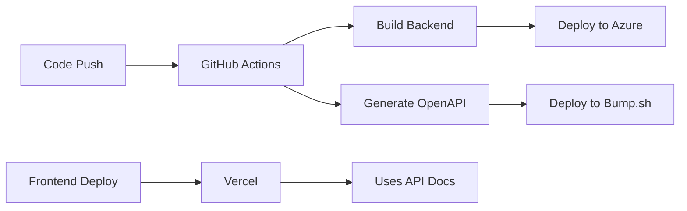

# API Documentation with Bump.sh

This guide explains how to set up and maintain beautiful API documentation for the Eventra backend using Bump.sh.

## 📚 What You Get

- **Beautiful Documentation**: Professional-looking API docs
- **Interactive Explorer**: Test APIs directly from the documentation
- **Version Control**: Track changes between API versions
- **Automatic Updates**: Docs update automatically when code changes
- **Team Collaboration**: Share docs with your team and external developers

## 🚀 Quick Setup

### 1. Start Your Application
```powershell
.\load-env.ps1
.\mvnw spring-boot:run
```

### 2. Run Setup Script
```powershell
.\setup-bump.ps1
```

### 3. Sign Up for Bump.sh
1. Go to [bump.sh](https://bump.sh/)
2. Create a free account
3. Create a new documentation project
4. Note your **Doc ID** and generate an **API Token**

### 4. Deploy Your Documentation
```powershell
# Install Bump.sh CLI (if not already installed)
npm install -g bump-sh-cli

# Deploy documentation
bump deploy openapi.json --doc <your-doc-id> --token <your-token>
```

## 🔧 Manual Generation

If you prefer to generate the OpenAPI spec manually:

```powershell
# Make sure your app is running
.\mvnw spring-boot:run

# In another terminal, download the OpenAPI spec
curl -o openapi.json http://localhost:8080/api-docs

# Or use PowerShell
Invoke-WebRequest -Uri "http://localhost:8080/api-docs" -OutFile "openapi.json"
```

## 🤖 Automatic Updates with GitHub Actions

The repository includes a GitHub Actions workflow that automatically updates your documentation when you push code changes.

### Setup GitHub Secrets:
1. Go to your GitHub repository
2. Navigate to **Settings** → **Secrets and variables** → **Actions**
3. Add these secrets:
   - `BUMP_DOC_ID`: Your Bump.sh document ID
   - `BUMP_TOKEN`: Your Bump.sh API token

### The workflow will:
- Build your application
- Generate the OpenAPI specification
- Deploy updated docs to Bump.sh
- Run on every push to main branch

## 📖 Available Documentation Endpoints

Once your application is running, you can access:

| Endpoint | Description |
|----------|-------------|
| `http://localhost:8080/swagger-ui.html` | Interactive Swagger UI |
| `http://localhost:8080/api-docs` | OpenAPI JSON specification |
| `http://localhost:8080/api-docs/swagger-config` | Swagger configuration |

## 🎨 Customizing Documentation

### Adding API Descriptions

Use OpenAPI annotations in your controllers:

```java
@Tag(name = "Authentication", description = "User authentication endpoints")
@RestController
public class AuthController {
    
    @Operation(
        summary = "Register new user",
        description = "Creates a new user account with the provided information"
    )
    @ApiResponses(value = {
        @ApiResponse(responseCode = "200", description = "User registered successfully"),
        @ApiResponse(responseCode = "400", description = "Invalid input data")
    })
    @PostMapping("/signup")
    public ResponseEntity<MessageResponse> signup(@RequestBody SignupRequest request) {
        // Implementation
    }
}
```

### Adding Model Documentation

Document your DTOs/models:

```java
@Schema(description = "User registration request")
public class SignupRequest {
    
    @Schema(description = "User's email address", example = "user@example.com")
    private String email;
    
    @Schema(description = "User's password", minLength = 8)
    private String password;
    
    // ... getters/setters
}
```

## 🔐 Security Documentation

JWT authentication is automatically documented. Users will see:
- How to obtain a JWT token via `/api/auth/login`
- How to use the token in the `Authorization: Bearer <token>` header
- Which endpoints require authentication

## 🌍 Multiple Environments

The OpenAPI configuration supports multiple servers:
- Local development: `http://localhost:8080`
- Azure production: `https://your-app.azurewebsites.net`
- Custom domain: `https://your-domain.com`

Update the servers in `OpenApiConfig.java` to match your deployment URLs.

## 💰 Bump.sh Pricing

- **Free**: Up to 3 public docs, basic features
- **Starter ($19/month)**: Up to 10 docs, private docs, custom domain
- **Team ($49/month)**: Unlimited docs, team features, analytics
- **Enterprise**: Custom pricing with advanced features

## 🔍 Best Practices

### 1. Keep Documentation Up-to-Date
- Use the GitHub Actions workflow for automatic updates
- Review documentation changes during code reviews

### 2. Provide Good Descriptions
- Add meaningful summaries and descriptions to all endpoints
- Include example request/response payloads
- Document error scenarios

### 3. Version Your API
- Use semantic versioning for your API
- Document breaking changes
- Maintain backward compatibility when possible

### 4. Test Your Documentation
- Regularly test the interactive examples
- Ensure all endpoints are documented
- Validate OpenAPI spec with tools like Swagger Editor

## 🛠️ Troubleshooting

### Common Issues:

**1. OpenAPI spec not generating**
- Ensure application is running on port 8080
- Check that SpringDoc dependencies are included
- Verify endpoints are accessible

**2. Bump.sh deployment fails**
- Check your API token and document ID
- Ensure OpenAPI spec is valid JSON
- Verify network connectivity

**3. Documentation not updating**
- Check GitHub Actions workflow logs
- Ensure secrets are properly configured
- Verify the workflow triggers on your branch

### Getting Help:
- [Bump.sh Documentation](https://docs.bump.sh/)
- [SpringDoc OpenAPI Documentation](https://springdoc.org/)
- [OpenAPI Specification](https://swagger.io/specification/)

## 📊 Analytics and Insights

Bump.sh provides analytics on:
- Documentation page views
- Most popular endpoints
- User engagement metrics
- Search queries

Access these insights in your Bump.sh dashboard to understand how developers use your API.

## 🎯 Next Steps

1. **Set up Bump.sh account** and deploy your first documentation
2. **Configure GitHub Actions** for automatic updates
3. **Add detailed descriptions** to all your API endpoints
4. **Share documentation** with your team and external developers
5. **Monitor usage** through Bump.sh analytics
6. **Iterate and improve** based on user feedback

## 🌐 Production Setup (Azure + Vercel)

Your current architecture:
- **Backend**: Azure Web App Service
- **Frontend**: Vercel deployment
- **API Docs**: Bump.sh (auto-updates on code changes)

### Deployment Flow



### Quick Commands

```powershell
# Deploy backend to Azure
.\deploy-azure.ps1

# Generate and deploy API docs manually
.\setup-bump.ps1
bump deploy openapi.json --doc <your-doc-id> --token <your-token>
```

### Frontend Integration

Your Vercel frontend can reference the API documentation at:
`https://bump.sh/your-hub-name/doc/eventra-api`

See `../docs/frontend-integration.md` for detailed integration guide.

### Environment URLs

- **Local Development**: `http://localhost:8080`
- **Azure Production**: `https://eventra-backend.azurewebsites.net`
- **API Documentation**: `https://bump.sh/your-hub-name/doc/eventra-api`
- **Frontend (Vercel)**: `https://your-app.vercel.app`
